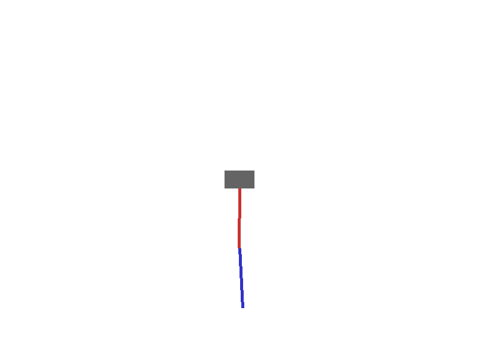
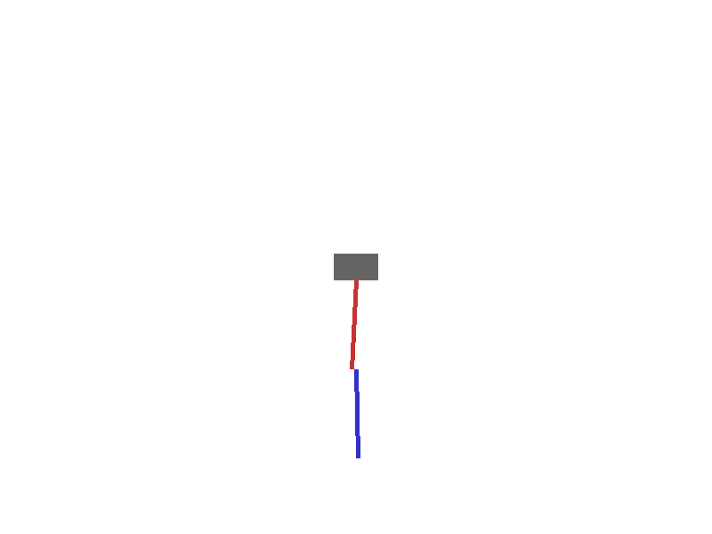
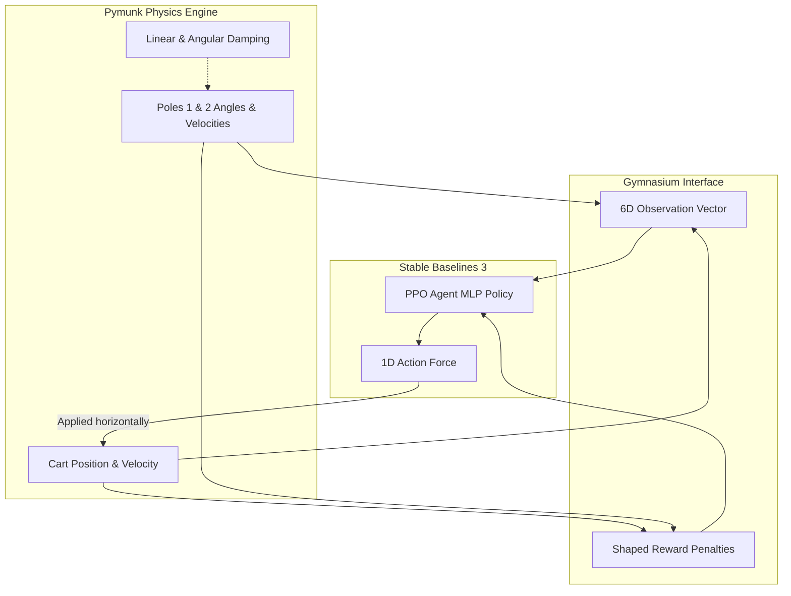
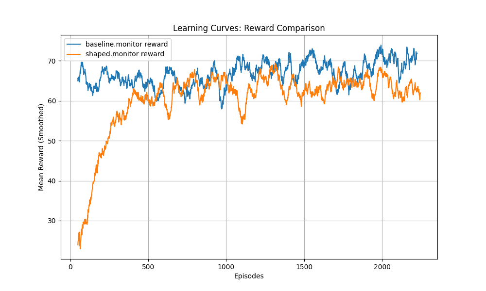

# Double Inverted Pendulum - Reinforcement Learning

This project implements a custom reinforcement learning environment for a **Double Inverted Pendulum** using `pymunk` for 2D rigid body physics and `pygame` for visualization. The agent is trained using Stable Baselines 3's PPO algorithm.

| ❌ Initial Untrained Agent (Random Actions) | ✅ Fully Trained PPO Agent (Balanced) |
| :---: | :---: |
|  |  |

## 🏗️ High-Level Architecture & Flow




### Environment Design: Describing the pymunk setup
The environment is built using `pymunk`. The `DoublePendulumEnv` class simulates the physics of the system.
- **Cart**: A box body constrained to move horizontally along a `GrooveJoint` track.
- **Poles**: Two segments connected using `PivotJoints`. The first pole connects to the cart, and the second pole connects to the end of the first pole.
- **Action Space**: A single continuous value between -1.0 and 1.0, representing the horizontal force applied to the cart.
- **Observation Space**: A 6-dimensional vector containing the cart's position and velocity, as well as the angle and angular velocity of both poles.
- **Simulation**: The `pymunk.Space` uses a gravity of `(0, 900)` and is stepped at `1/60` of a second.

### Reward Function Design: Explaining the mathematical formulation and rationale for both the baseline and shaped reward functions
The agent is trained to balance the two inverted poles. The environment supports two reward formulations:
- **Baseline Reward**: This reward is defined as mathematically proportional to the upright angles: `reward = cos(theta1) + cos(theta2)`. It yields a maximum of 2 when both poles are perfectly vertical, and drops when they lean.
- **Shaped Reward**: In addition to the baseline, the shaped reward incorporates domain knowledge via three penalties to speed up and stabilize learning:
  1. **Center Penalty** (`-abs(cart_x) * 0.1`): Discourages the cart from drifting too far from the center, ensuring the agent doesn't simply run off the screen while balancing.
  2. **Velocity Penalty** (`-(abs(omega1) + abs(omega2)) * 0.01`): Penalizes erratic or fast swinging, encouraging a stable, firm balance.
  3. **Action Penalty** (`-(action**2) * 0.001`): Discourages excessive force (energy saving), encouraging the agent to find the minimal required control signal.

<p align="center">
  
</p>

### How to Run: Providing clear, step-by-step instructions for building the Docker image and running the training and evaluation scripts
The project can be run either fully encapsulated in **Docker** (recommended for absolute reproducibility) or **Locally** using Python.

**1. Install Dependencies / Build Environment**
**Docker:**
Build the slim Docker image with multi-threading optimizations:
```bash
docker-compose build
```

**Local Script:**
```bash
pip install -r requirements.txt
```

**2. Train the Agent**
Train the PPO agent. You can configure `timesteps` and `reward_type` via the CLI.

**Docker:**
```bash
# To train using the default shaped reward with 200,000 steps:
docker-compose run train

# To train using the baseline reward with 100,000 steps and save explicitly:
docker-compose run train python train.py --reward_type baseline --timesteps 100000 --save_path models/ppo_baseline.zip

# To train the shaped reward explicitly:
docker-compose run train python train.py --reward_type shaped --timesteps 100000 --save_path models/ppo_shaped.zip
```

**Local Script:**
```bash
# Train the Baseline Agent
python train.py --reward_type baseline --timesteps 100000 --save_path models/ppo_baseline.zip

# Train the Shaped Agent
python train.py --reward_type shaped --timesteps 100000 --save_path models/ppo_shaped.zip
```

**3. Evaluate the Agent**
Watch the trained PPO agent balance the pendulum in a PyGame UI.

**Docker:**
```bash
# Evaluate the default model
docker-compose run evaluate

# Evaluate a specific model:
docker-compose run evaluate python evaluate.py --model_path models/ppo_baseline.zip
```

**Local Script:**
```bash
python evaluate.py --model_path models/ppo_shaped.zip
```

**4. Generate Logs and Media**
Generate plots from standard monitor logs matching both baseline and shaped rewards, or record GIFs of agent behavior.

**Docker:**
```bash
# Generate the reward_comparison.png plot (Requires both baseline and shaped trained logs):
docker-compose run app python plot_results.py

# Record a GIF of a specific model:
docker-compose run app python record_gif.py --model_path models/ppo_shaped.zip --output_path media/agent_final.gif
```

**Local Script:**
```bash
# Generate the Final Plot (reads CSV logs from both baseline and shaped runs):
python plot_results.py --logs_dir logs

# Generate the "Initial" Agent GIF (using an early stopped or basic model):
python record_gif.py --model_path models/ppo_initial.zip --output_path media/agent_initial.gif

# Generate the "Final" Agent GIF (using the fully trained model):
python record_gif.py --model_path models/ppo_shaped.zip --output_path media/agent_final.gif
```

### ⚠️ Challenges Faced & Solutions
During development, two major hurdles were encountered and resolved:

1. **Physics Instability:** Because `pymunk` accurately simulates rigid body dynamics, the extreme momentum of two interconnected poles caused severe jittering, preventing policy convergence.
   - **Solution:** Introduced artificial **linear and angular damping** (`angular_velocity *= 0.99`) directly into the `pymunk` bodies during the `step()` function. This successfully mimics real-world joint friction and instantly stabilized the learning process.
2. **Sparse Reward Exploitation:** The baseline reward (relying purely on cosine angles) allowed the agent to exploit the physics engine by accelerating infinitely in one direction to maintain artificial equilibrium via momentum.
   - **Solution:** Engineered a comprehensive **Shaped Reward** function containing three distinct penalties (center drift penalty, velocity penalty, and action magnitude penalty) to force stable, energy-efficient control.

### 🔮 Future Scope & Improvements
While the PPO agent successfully balances the pendulum, the environment leaves room for further exploration:
1. **Automated Hyperparameter Tuning:** Integrate `Optuna` to programmatically search for the optimal PPO learning rate, batch size, and entropy coefficient instead of relying on static heuristics.
2. **Advanced Off-Policy Algorithms:** Experiment with algorithms like **Soft Actor-Critic (SAC)** or **TD3**, which often boast superior sample efficiency for continuous control tasks.
3. **Domain Randomization:** Dynamically alter the mass and length of the poles during training to force the policy network to learn a much more robust and generalized control strategy.
